# matplotlib库中常用函数，及其参数解释

## 1.plot()与show()

在正文的1.2节中，调用了matplotlib中的pyplot

官方的对matplotlib.pyplot的解释是这样的：

> Provides a MATLAB-like plotting framework.

是一个用来提供类MATLAB的绘图框架，其中包含了若干函数，用来进行图形绘制。

最基础的一个Pyplot的函数是**plot()**

**plot()** 函数是绘制二维图形的最基本函数。

其语法格式如下：

```python
# 画单条线
plot([x], y, [fmt], *, data=None, **kwargs)
# 画多条线
plot([x], y, [fmt], [x2], y2, [fmt2], ..., **kwargs)
```

> 参数说明：
>
> - **x, y：**点或线的节点，x 为 x 轴数据，y 为 y 轴数据，数据可以列表或数组。
> - **fmt：**可选，定义基本格式（如颜色、标记和线条样式）。
> - ***\*kwargs：**可选，用在二维平面图上，设置指定属性，如标签，线的宽度等。

**show()**的作用是打开matplotlib查看器，并将绘制的figure显示出来

## 2.设置图表样式

### 2.1在plot()上设置线条样式

#### 2.1.1绘图标记

实例：

```python
#practice to set the marker
import matplotlib.pyplot as plt
import numpy as np
ypoints = np.array([1,2,3,5,7,3,1,9,0,3,4,5])

plt.plot(ypoints,marker='*')
plt.show()
```

result：

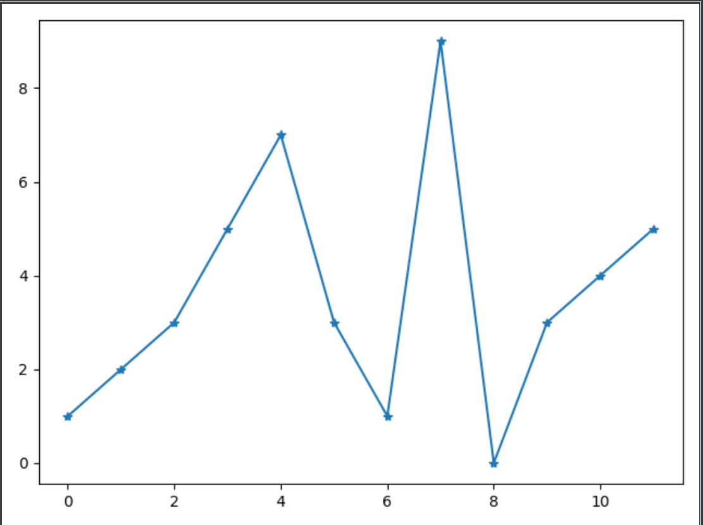

这里可以看到，给plot()设置了一个参数marker，改变了每个节点的形状。matplotlib.pyplot预设了以下几种可以定义的符号：

| 标记               | 符号                                          | 描述                                         |
| :----------------- | :-------------------------------------------- | :------------------------------------------- |
| "."                |  | 点                                           |
| ","                |  | 像素点                                       |
| "o"                |  | 实心圆                                       |
| "v"                |  | 下三角                                       |
| "^"                |  | 上三角                                       |
| "<"                |  | 左三角                                       |
| ">"                |  | 右三角                                       |
| "1"                |  | 下三叉                                       |
| "2"                |  | 上三叉                                       |
| "3"                |  | 左三叉                                       |
| "4"                |  | 右三叉                                       |
| "8"                |  | 八角形                                       |
| "s"                |  | 正方形                                       |
| "p"                |  | 五边形                                       |
| "P"                |  | 加号（填充）                                 |
| "*"                |  | 星号                                         |
| "h"                |  | 六边形 1                                     |
| "H"                |  | 六边形 2                                     |
| "+"                |  | 加号                                         |
| "x"                |  | 乘号 x                                       |
| "X"                |  | 乘号 x (填充)                                |
| "D"                |  | 菱形                                         |
| "d"                |  | 瘦菱形                                       |
| "\|"               |  | 竖线                                         |
| "_"                |  | 横线                                         |
| 0 (TICKLEFT)       |  | 左横线                                       |
| 1 (TICKRIGHT)      |  | 右横线                                       |
| 2 (TICKUP)         |  | 上竖线                                       |
| 3 (TICKDOWN)       |  | 下竖线                                       |
| 4 (CARETLEFT)      |  | 左箭头                                       |
| 5 (CARETRIGHT)     |  | 右箭头                                       |
| 6 (CARETUP)        |  | 上箭头                                       |
| 7 (CARETDOWN)      |  | 下箭头                                       |
| 8 (CARETLEFTBASE)  |  | 左箭头 (中间点为基准)                        |
| 9 (CARETRIGHTBASE) |  | 右箭头 (中间点为基准)                        |
| 10 (CARETUPBASE)   |  | 上箭头 (中间点为基准)                        |
| 11 (CARETDOWNBASE) |  | 下箭头 (中间点为基准)                        |
| "None", " " or ""  |                                               | 没有任何标记                                 |
| '$...$'            |  | 渲染指定的字符。例如 "$f$" 以字母 f 为标记。 |

##### **fmt**

提到了绘图标记，就不得不提**fmt**参数

```python
fmt = '[marker][line][color]'
```

> 其中marker就是上述的节点标记
>
> line是对线条样式设置
>
> color是对线条颜色设置

例如：

```python
import matplotlib.pyplot as plt
import numpy as np

ypoints = np.array([1,2,3,5,7,3,1,9,0,3,4,5])

plt.plot(ypoints,'o:r')
plt.show()
```

Result：

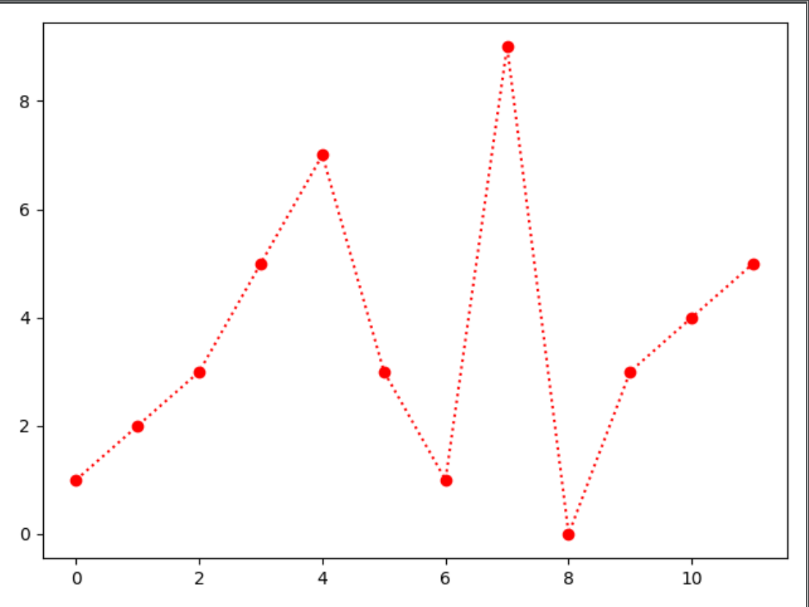

这里matplotlib.pyplot同样也提供了许多线类型与颜色类型：

| 线类型标记 |  描述  |
| :--------: | :----: |
|    '-'     |  实线  |
|    ':'     |  虚线  |
|    '--'    | 破折线 |
|    '-.'    | 点划线 |

| 颜色标记 | 描述 |
| :------: | :--: |
|   'r'    | 红色 |
|   'g'    | 绿色 |
|   'b'    | 蓝色 |
|   'c'    | 青色 |
|   'm'    | 品红 |
|   'y'    | 黄色 |
|   'k'    | 黑色 |
|   'w'    | 白色 |

##### **标记大小与颜色**

> 我们可以自定义标记的大小与颜色，使用的参数分别是：
>
> - markersize，简写为 **ms**：定义标记的大小。
> - markerfacecolor，简写为 **mfc**：定义标记内部的颜色。
> - markeredgecolor，简写为 **mec**：定义标记边框的颜色。

示例：

```python
import matplotlib.pyplot as plt
import numpy as np

ypoints = np.array([1,2,3,5,7,3,1,9,0,3,4,5])

plt.plot(ypoints,marker='o',ms = 10,mfc = 'r',mec = 'b')
plt.show()
```

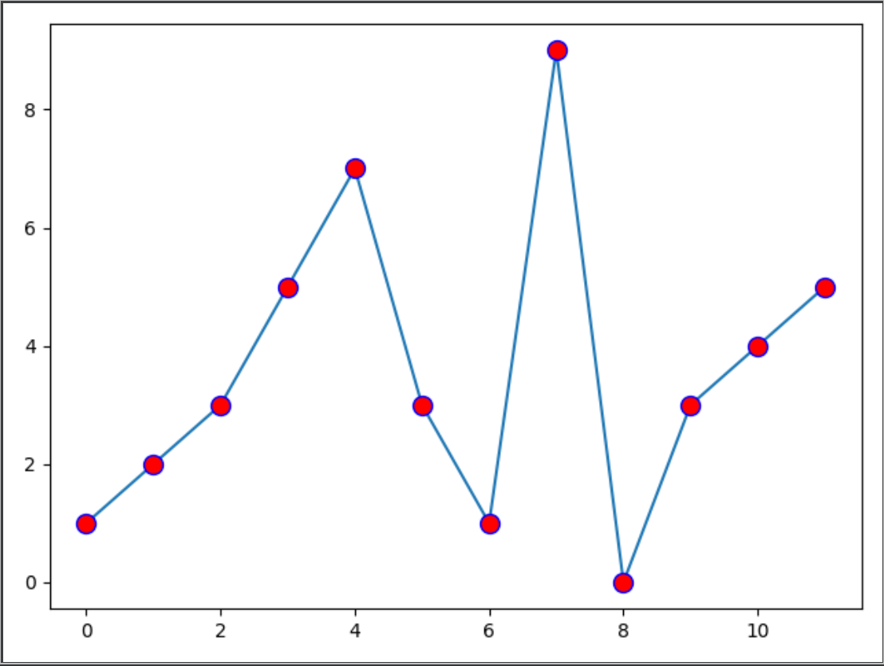

#### 2.1.2绘图线

##### 线类型

上文说到，**plot()**绘制的线条样式，可以在**fmt**中设置。同时节点可以直接用**marker**设置。

同样，线条样式也可以直接用**linestyle**来设置，简写为**ls**

|      类型      |   简写    |  说明  |
| :------------: | :-------: | :----: |
| 'solid' (默认) |    '-'    |  实线  |
|    'dotted'    |    ':'    | 点虚线 |
|    'dashed'    |   '--'    | 破折线 |
|   'dashdot'    |   '-.'    | 点划线 |
|     'None'     | '' 或 ' ' | 不画线 |

```python
import matplotlib.pyplot as plt
import numpy as np

ypoints = np.array([1,2,3,5,7,3,1,9,0,3,4,5])

plt.plot(ypoints,ls = 'dashed')
plt.show()
```

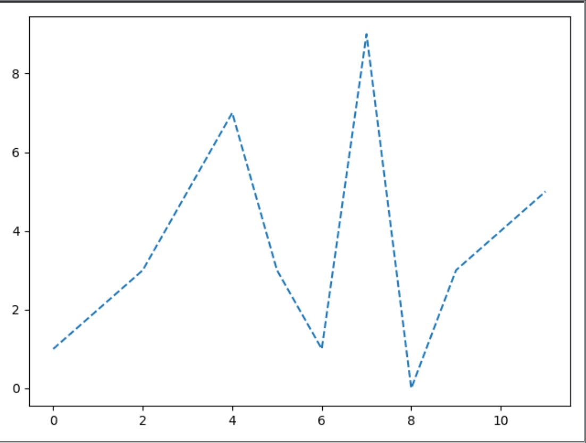

线的颜色可以使用 **color** 参数来定义，简写为 **c**。

##### 颜色类型：

| 颜色标记 | 描述 |
| :------- | :--- |
| 'r'      | 红色 |
| 'g'      | 绿色 |
| 'b'      | 蓝色 |
| 'c'      | 青色 |
| 'm'      | 品红 |
| 'y'      | 黄色 |
| 'k'      | 黑色 |
| 'w'      | 白色 |

##### 线的宽度

线的宽度可以使用 **linewidth** 参数来定义，简写为 **lw**，值可以是浮点数，如：**1**、**2.0**、**5.67** 等。

示例：

```python
import numpy as np
import matplotlib.pyplot as plt
ypoints = np.array([1,2,3,5,7,3,1,9,0,3,4,5])

plt.plot(ypoints,ls = '-.',c = 'g',lw = '3')
plt.show()
```

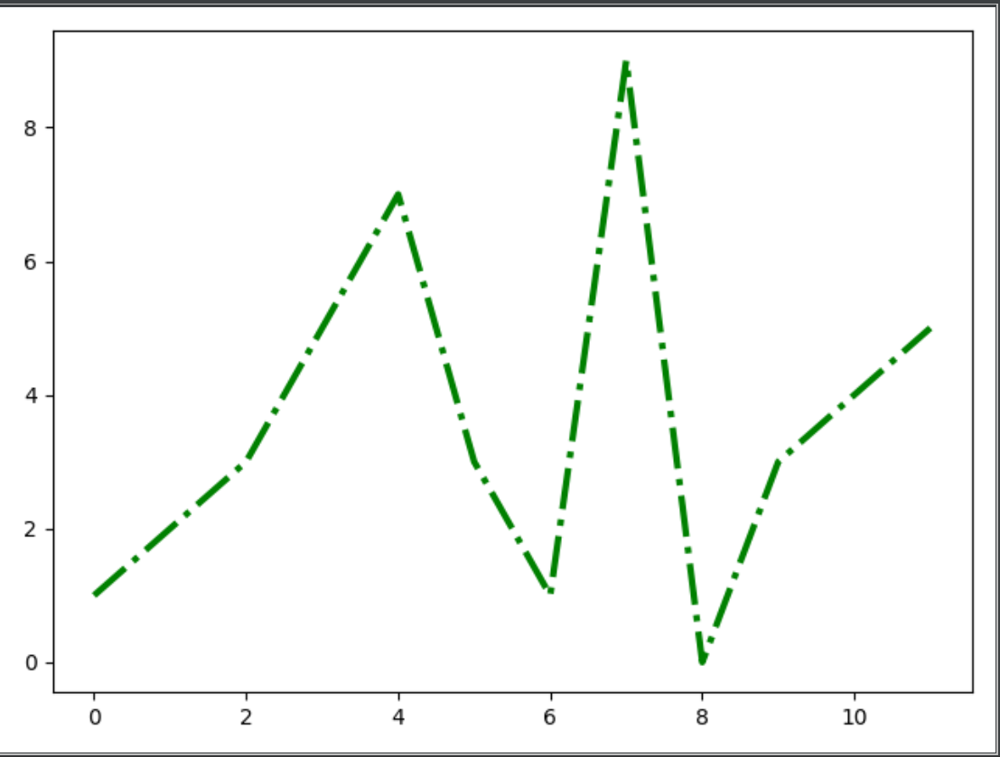

##### 多条线

```python
import numpy as np
import matplotlib.pyplot as plt


ypoint1 = np.array([1,2,3,5,7,3,1,9,0,3,4,5])
ypoint2 = np.array([1,10,3,6,7,3,2,5,7,8,2,1])

plt.plot(ypoint1,ls = '-.',lw = 2,c = 'r',marker = 'o',ms = 4)
plt.plot(ypoint2)

plt.show()
```

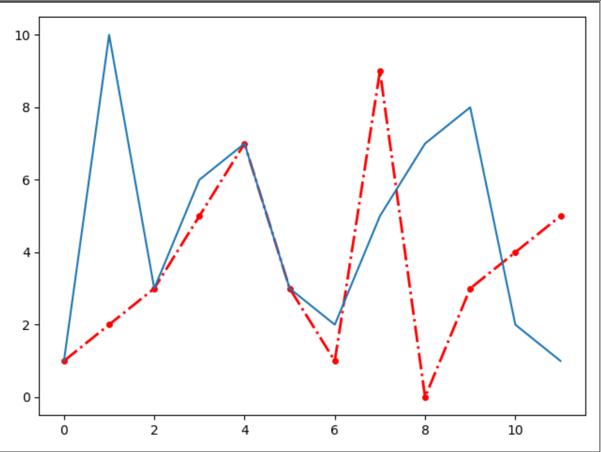

### 2.2图表标题和双轴样式

##### 标签与标题设置

```python
plt.xlabel()#设置x轴标签
plt.ylabel()#设置y轴标签
plt.title()#设置标题

```

```python
import numpy as np
import matplotlib.pyplot as plt

xpoints = np.array([1,2,3,4,5,6,7,8,9,10,11,12,13,14])
ypoints = np.array([1,4,3,4,7,8,2,1,4,5,8,9,2,10])

plt.plot(xpoints,ypoints,ls=':',lw=3,c='g',marker='*',mfc='r',mec='g',ms = 10)

plt.xlabel("x-label")
plt.ylabel("y-label")
plt.title("Practice of data visualization")

plt.show()
```

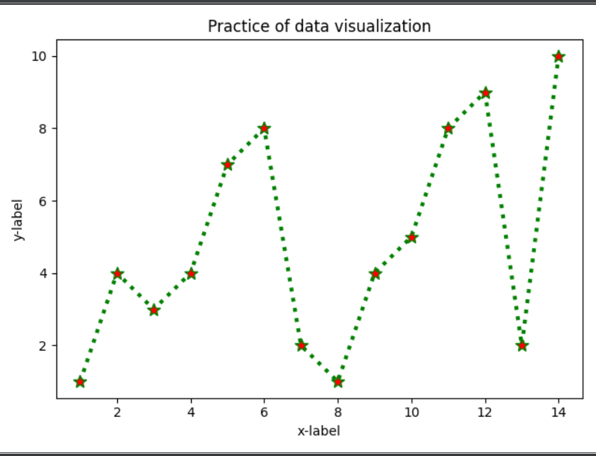

##### 适配中文

```python
from matplotlib import pyplot as plt
import matplotlib
a = sorted([f.name for f in matplotlib.font_manager.fontManager.ttflist])

for i in a:
    print(i)
```

通过以上代码，打印系统中存在的字体

##### 设置标签与标题样式

title(), xlabel(), 均提供了参数**loc**来设置其显示的位置，可以设置为: **'left', 'right', 和 'center'， 默认值为 'center'**。

ylabel(),也提供了参数**loc**来设置其显示的位置，可以设置为: **'bottom', 'top', 和 'center'， 默认值为 'center'**。

```python
import numpy as np
import matplotlib.pyplot as plt
import matplotlib


xpoints = np.array([1,2,3,4,5,6,7,8,9,10,11,12,13,14])
ypoints = np.array([1,4,3,4,7,8,2,1,4,5,8,9,2,10])

plt.plot(xpoints,ypoints,ls=':',lw=3,c='g',marker='*',mfc='r',mec='g',ms = 10)

plt.xlabel("x-label",loc = 'center')
plt.ylabel("y-label",loc = 'top')
plt.title("Practice of data visualization",loc = 'right')

plt.show()
```

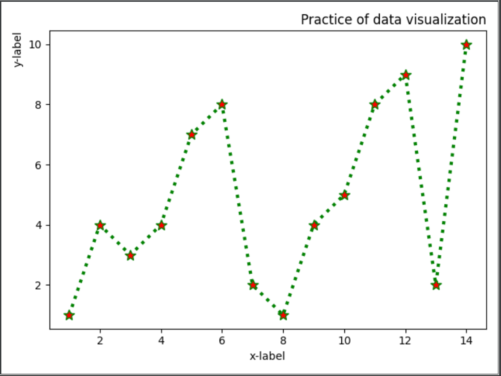

## 3.网格线

##### grid()

pyplot中提供了grid()方法来设置图表中的网格线

grid() 方法语法格式如下：

```python
matplotlib.pyplot.grid(b=None, which='major', axis='both', )
```

**参数说明：**

- **b**：可选，默认为 None，可以设置布尔值，true 为显示网格线，false 为不显示，如果设置 **kwargs 参数，则值为 true。
- **which**：可选，可选值有 'major'、'minor' 和 'both'，默认为 'major'，表示应用更改的网格线。
- **axis**：可选，设置显示哪个方向的网格线，可以是取 'both'（默认），'x' 或 'y'，分别表示两个方向，x 轴方向或 y 轴方向。
- ***\*kwargs**：可选，设置网格样式，可以是 color='r', linestyle='-' 和 linewidth=2，分别表示网格线的颜色，样式和宽度。

```python
import numpy as np
import matplotlib.pyplot as plt
xpoints = np.array([1,2,3,4,5,6,7,8,9,10,11,12,13,14])
ypoints = np.array([1,4,3,4,7,8,2,1,4,5,8,9,2,10])
plt.plot(xpoints,ypoints,ls=':',lw=3,c='g',marker='*',mfc='r',mec='g',ms = 10)
plt.xlabel("x-label",loc = 'center')
plt.ylabel("y-label",loc = 'top')
plt.title("Practice of data visualization",loc = 'right')

plt.grid()

plt.show()
```

不设置任何参数结果如下


##### 网格线样式

以下实例添加一个简单的网格线，并设置网格线的样式，格式如下：

```
grid(color = 'color', linestyle = 'linestyle', linewidth = number)
```

**参数说明：**

**color：**'b' 蓝色，'m' 洋红色，'g' 绿色，'y' 黄色，'r' 红色，'k' 黑色，'w' 白色，'c' 青绿色，'#008000' RGB 颜色符串。

**linestyle：**'‐' 实线，'‐‐' 破折线，'‐.' 点划线，':' 虚线。

**linewidth**：设置线的宽度，可以设置一个数字。

接下来实现一个只显示横向的网格，并为其添加颜色和样式

```python
import numpy as np
import matplotlib.pyplot as plt

xpoints = np.array([1,2,3,4,5,6,7,8,9,10,11,12,13,14])
ypoints = np.array([1,4,3,4,7,8,2,1,4,5,8,9,2,10])

plt.plot(xpoints,ypoints,ls=':',lw=3,c='g',marker='*',mfc='r',mec='g',ms = 10)

plt.xlabel("x-label",loc = 'center')
plt.ylabel("y-label",loc = 'top')
plt.title("Practice of data visualization",loc = 'right')

plt.grid(axis = 'y',color = 'r',linestyle = ':',linewidth = '2')

plt.show()
```

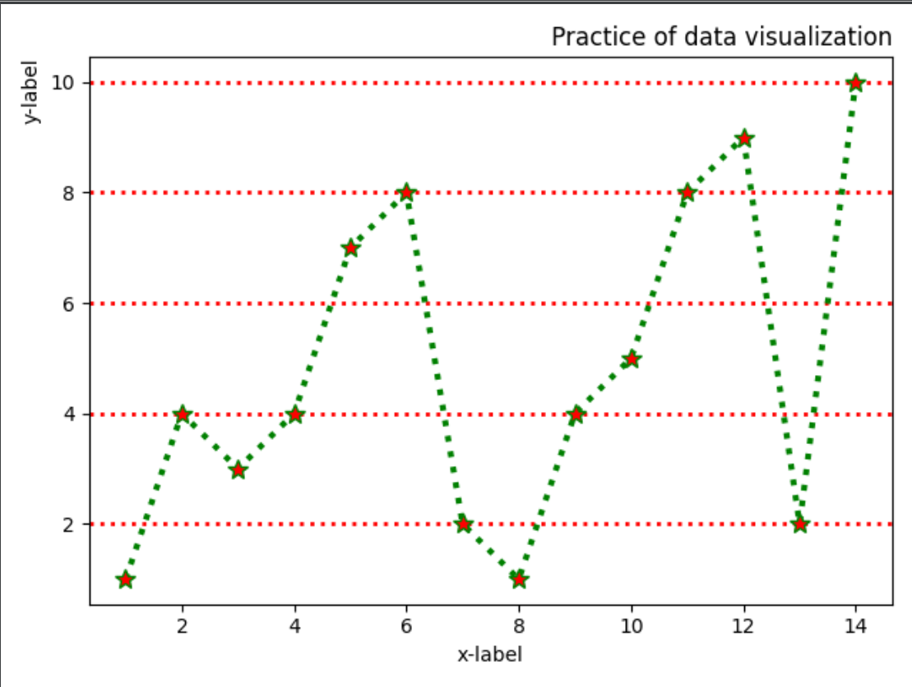

## 4.散点图

##### scatter()基础知识

除了之前用**plot()**绘制的线形图以外，**pyplot**还提供一个**scatter()**方法来绘制散点图

scatter() 方法语法格式如下：

```
matplotlib.pyplot.scatter(x, y, s=None, c=None, marker=None, cmap=None, norm=None, vmin=None, vmax=None, alpha=None, linewidths=None, *, edgecolors=None, plotnonfinite=False, data=None, **kwargs)
```

**参数说明：**

**x，y**：长度相同的数组，也就是我们即将绘制散点图的数据点，输入数据。

**s**：点的大小，默认 20，也可以是个数组，数组每个参数为对应点的大小。

**c**：点的颜色，默认蓝色 'b'，也可以是个 RGB 或 RGBA 二维行数组。

**marker**：点的样式，默认小圆圈 'o'。

**cmap**：Colormap，默认 None，标量或者是一个 colormap 的名字，只有 c 是一个浮点数数组的时才使用。如果没有申明就是 image.cmap。

**norm**：Normalize，默认 None，数据亮度在 0-1 之间，只有 c 是一个浮点数的数组的时才使用。

**vmin，vmax：**：亮度设置，在 norm 参数存在时会忽略。

**alpha：**：透明度设置，0-1 之间，默认 None，即不透明。

**linewidths：**：标记点的长度。

**edgecolors：**：颜色或颜色序列，默认为 'face'，可选值有 'face', 'none', None。

**plotnonfinite：**：布尔值，设置是否使用非限定的 c ( inf, -inf 或 nan) 绘制点。

***\*kwargs：**：其他参数。

```python
import numpy as np
import matplotlib.pyplot as plt

x = np.array([1,2,3,4,5,6,7,8])
y = np.array([3,1,8,9,12,3,11,18])

plt.scatter(x,y)
plt.show()
```

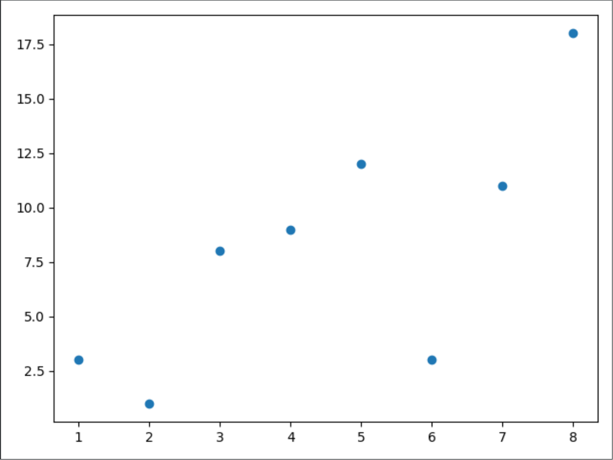

##### 设置点的大小与颜色

```python
import numpy as np
import matplotlib.pyplot as plt

x = np.array([1,2,3,4,5,6,7,8])
y = np.array([3,1,8,9,12,3,11,18])

sizes = np.array([10,20,40,80,160,320,640,1280])
colors = np.array(["red","green","black","orange","purple","beige","cyan","magenta"])

plt.scatter(x,y,s = sizes,c = colors)
plt.show()
```

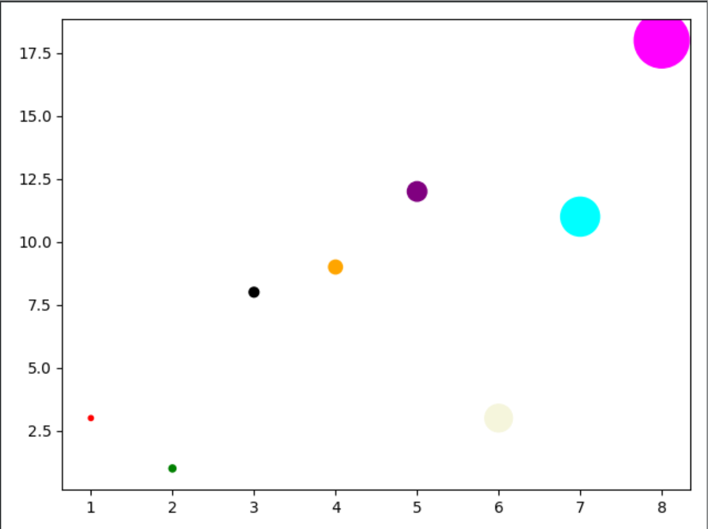

##### 添加两组散点

```python
import numpy as np
import matplotlib.pyplot as plt

x = np.array([i for i in range(1,8)])
y = np.array([i for i in range(1,20,3)])
plt.scatter(x,y,color = 'hotpink')

x = np.array([i for i in range(1,8)])
y = np.array([i for i in range(5,25,3)])
plt.scatter(x,y,color = '#88c999')

plt.show()
```

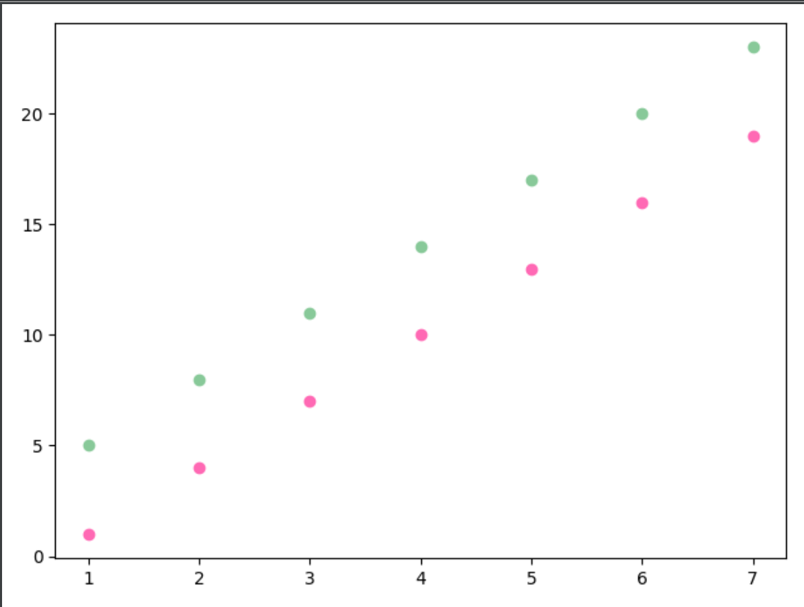

##### 随机散点图

```python
import numpy as np
import matplotlib.pyplot as plt

np.random.seed(19680801)

N = 50
x = np.random.rand(N)
y = np.random.rand(N)
colors = np.random.rand(N)
area = (30*np.random.rand(N))**2

plt.scatter(x,y,s = area, c = colors,alpha = 0.5)
plt.title("New test")

plt.show()
```

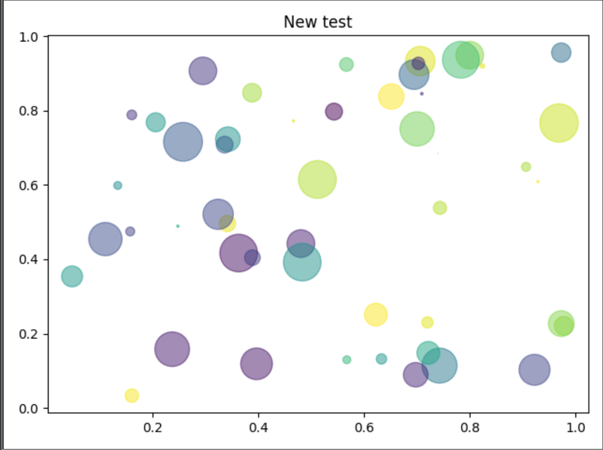

##### 渐变色

matplotlib模块提供了很多可用的渐变色条

设置一个渐变色条需要用到**cmap**，其默认值为**‘viridis’**

```python
import numpy as np
import matplotlib.pyplot as plt

x = np.array([i for i in range(1,11)])
y = np.array([i for i in range(1,101,10)])

colors = np.array([i for i in range(1,101,10)])

plt.scatter(x, y, c = colors, cmap='viridis')
plt.colorbar()

plt.show()
```


颜色条参数值可以是以下值：

|     颜色名称     |     保留关键字     |
| :--------------: | :----------------: |
|      Accent      |      Accent_r      |
|      Blues       |      Blues_r       |
|       BrBG       |       BrBG_r       |
|       BuGn       |       BuGn_r       |
|       BuPu       |       BuPu_r       |
|      CMRmap      |      CMRmap_r      |
|      Dark2       |      Dark2_r       |
|       GnBu       |       GnBu_r       |
|      Greens      |      Greens_r      |
|      Greys       |      Greys_r       |
|       OrRd       |       OrRd_r       |
|     Oranges      |     Oranges_r      |
|       PRGn       |       PRGn_r       |
|      Paired      |      Paired_r      |
|     Pastel1      |     Pastel1_r      |
|     Pastel2      |     Pastel2_r      |
|       PiYG       |       PiYG_r       |
|       PuBu       |       PuBu_r       |
|      PuBuGn      |      PuBuGn_r      |
|       PuOr       |       PuOr_r       |
|       PuRd       |       PuRd_r       |
|     Purples      |     Purples_r      |
|       RdBu       |       RdBu_r       |
|       RdGy       |       RdGy_r       |
|       RdPu       |       RdPu_r       |
|      RdYlBu      |      RdYlBu_r      |
|      RdYlGn      |      RdYlGn_r      |
|       Reds       |       Reds_r       |
|       Set1       |       Set1_r       |
|       Set2       |       Set2_r       |
|       Set3       |       Set3_r       |
|     Spectral     |     Spectral_r     |
|      Wistia      |      Wistia_r      |
|       YlGn       |       YlGn_r       |
|      YlGnBu      |      YlGnBu_r      |
|      YlOrBr      |      YlOrBr_r      |
|      YlOrRd      |      YlOrRd_r      |
|      afmhot      |      afmhot_r      |
|      autumn      |      autumn_r      |
|      binary      |      binary_r      |
|       bone       |       bone_r       |
|       brg        |       brg_r        |
|       bwr        |       bwr_r        |
|     cividis      |     cividis_r      |
|       cool       |       cool_r       |
|     coolwarm     |     coolwarm_r     |
|      copper      |      copper_r      |
|    cubehelix     |    cubehelix_r     |
|       flag       |       flag_r       |
|    gist_earth    |    gist_earth_r    |
|    gist_gray     |    gist_gray_r     |
|    gist_heat     |    gist_heat_r     |
|    gist_ncar     |    gist_ncar_r     |
|   gist_rainbow   |   gist_rainbow_r   |
|    gist_stern    |    gist_stern_r    |
|    gist_yarg     |    gist_yarg_r     |
|     gnuplot      |     gnuplot_r      |
|     gnuplot2     |     gnuplot2_r     |
|       gray       |       gray_r       |
|       hot        |       hot_r        |
|       hsv        |       hsv_r        |
|     inferno      |     inferno_r      |
|       jet        |       jet_r        |
|      magma       |      magma_r       |
|  nipy_spectral   |  nipy_spectral_r   |
|      ocean       |      ocean_r       |
|       pink       |       pink_r       |
|      plasma      |      plasma_r      |
|      prism       |      prism_r       |
|     rainbow      |     rainbow_r      |
|     seismic      |     seismic_r      |
|      spring      |      spring_r      |
|      summer      |      summer_r      |
|      tab10       |      tab10_r       |
|      tab20       |      tab20_r       |
|      tab20b      |      tab20b_r      |
|      tab20c      |      tab20c_r      |
|     terrain      |     terrain_r      |
|     twilight     |     twilight_r     |
| twilight_shifted | twilight_shifted_r |
|     viridis      |     viridis_r      |
|      winter      |      winter_r      |


## 5.柱状图

接下来介绍柱状图的绘制方法

##### bar()

bar() 方法语法格式如下：

```python
matplotlib.pyplot.bar(x, height, width=0.8, bottom=None, *, align='center', data=None, **kwargs)
```

**参数说明：**

**x**：浮点型数组，柱形图的 x 轴数据。

**height**：浮点型数组，柱形图的高度。

**width**：浮点型数组，柱形图的宽度。

**bottom**：浮点型数组，底座的 y 坐标，默认 0。

**align**：柱形图与 x 坐标的对齐方式，'center' 以 x 位置为中心，这是默认值。 'edge'：将柱形图的左边缘与 x 位置对齐。要对齐右边缘的条形，可以传递负数的宽度值及 align='edge'。

***\*kwargs：**：其他参数。

以下实例我们简单实用 bar() 来创建一个柱形图:

```python
import numpy as np
import matplotlib.pyplot as plt

x = np.array(['one','two','three','four','five'])
y = np.array([10,4,18,27,13])

plt.bar(x,y)
plt.show()
```


##### barh()

```python
import numpy as np
import matplotlib.pyplot as plt

x = np.array(['one','two','three','four','five'])
y = np.array([10,4,18,27,13])

plt.barh(x,y)
plt.show()
```

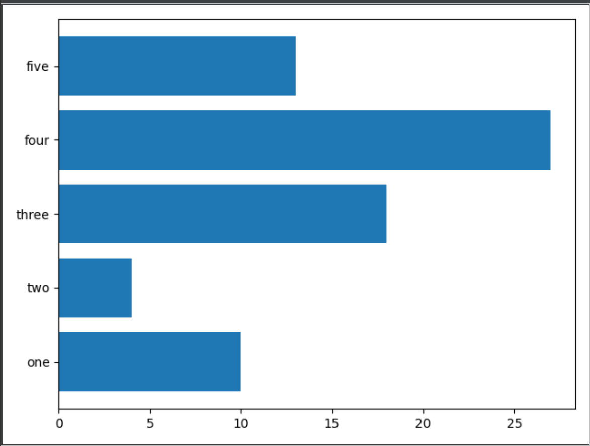

##### width与height

```python
import numpy as np
import matplotlib.pyplot as plt

plt.subplot(1,2,1)
x = np.array(['one','two','three','four','five'])
y = np.array([10,4,18,27,13])
colors = ["#4CAF50","red","hotpink","#556B2F","blue"]

plt.bar(x,y,color = colors,width = 0.1)

plt.subplot(1,2,2)
x = np.array(['one','two','three','four','five'])
y = np.array([10,4,18,27,13])
colors = ["#4CAF50","red","hotpink","#556B2F","blue"]

plt.barh(x,y,color = colors,height = 0.1)

plt.show()
```

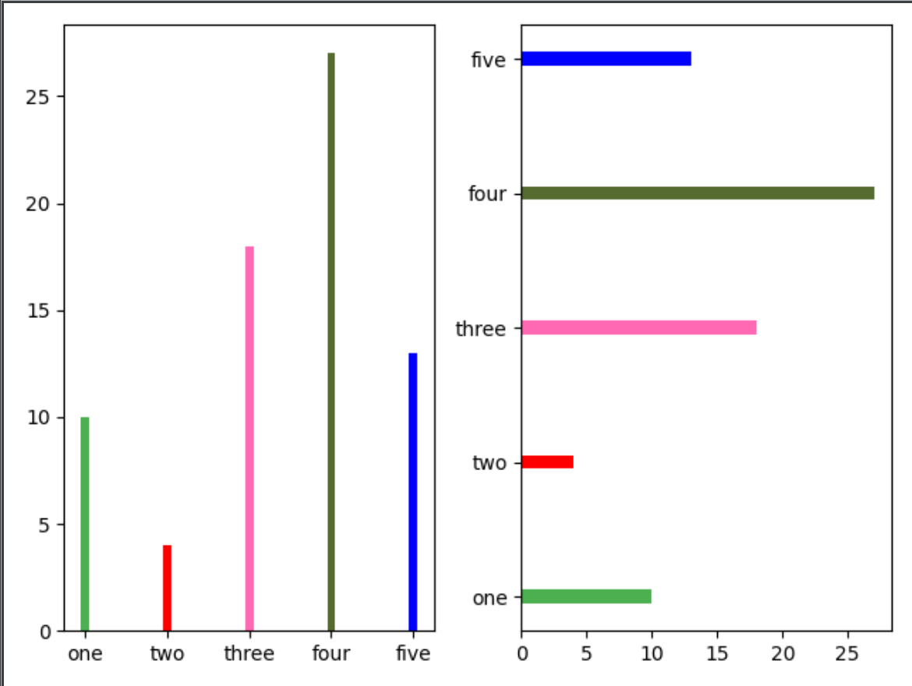

## 6.饼图

##### pie()

我们可以使用 pyplot 中的 pie() 方法来绘制散点图。

pie() 方法语法格式如下：

```python
matplotlib.pyplot.pie(x, explode=None, labels=None, colors=None, autopct=None, pctdistance=0.6, shadow=False, labeldistance=1.1, startangle=0, radius=1, counterclock=True, wedgeprops=None, textprops=None, center=0, 0, frame=False, rotatelabels=False, *, normalize=None, data=None)[source]
```

**参数说明：**

**x**：浮点型数组，表示每个扇形的面积。

**explode**：数组，表示各个扇形之间的间隔，默认值为0。

**labels**：列表，各个扇形的标签，默认值为 None。

**colors**：数组，表示各个扇形的颜色，默认值为 None。

**autopct**：设置饼图内各个扇形百分比显示格式，**%d%%** 整数百分比，**%0.1f** 一位小数， **%0.1f%%** 一位小数百分比， **%0.2f%%** 两位小数百分比。

**labeldistance**：标签标记的绘制位置，相对于半径的比例，默认值为 1.1，如 **<1**则绘制在饼图内侧。

**pctdistance：**：类似于 labeldistance，指定 autopct 的位置刻度，默认值为 0.6。

**shadow：**：布尔值 True 或 False，设置饼图的阴影，默认为 False，不设置阴影。

**radius：**：设置饼图的半径，默认为 1。

**startangle：**：起始绘制饼图的角度，默认为从 x 轴正方向逆时针画起，如设定 =90 则从 y 轴正方向画起。

**counterclock**：布尔值，设置指针方向，默认为 True，即逆时针，False 为顺时针。

**wedgeprops** ：字典类型，默认值 None。参数字典传递给 wedge 对象用来画一个饼图。例如：wedgeprops={'linewidth':5} 设置 wedge 线宽为5。

**textprops** ：字典类型，默认值为：None。传递给 text 对象的字典参数，用于设置标签（labels）和比例文字的格式。

**center** ：浮点类型的列表，默认值：(0,0)。用于设置图标中心位置。

**frame** ：布尔类型，默认值：False。如果是 True，绘制带有表的轴框架。

**rotatelabels** ：布尔类型，默认为 False。如果为 True，旋转每个 label 到指定的角度。

以下实例我们简单实用 pie() 来创建一个柱形图:

```python
import numpy as np
import matplotlib.pyplot as plt

y = np.array([35,25,25,15])

plt.pie(y)
plt.show()
```

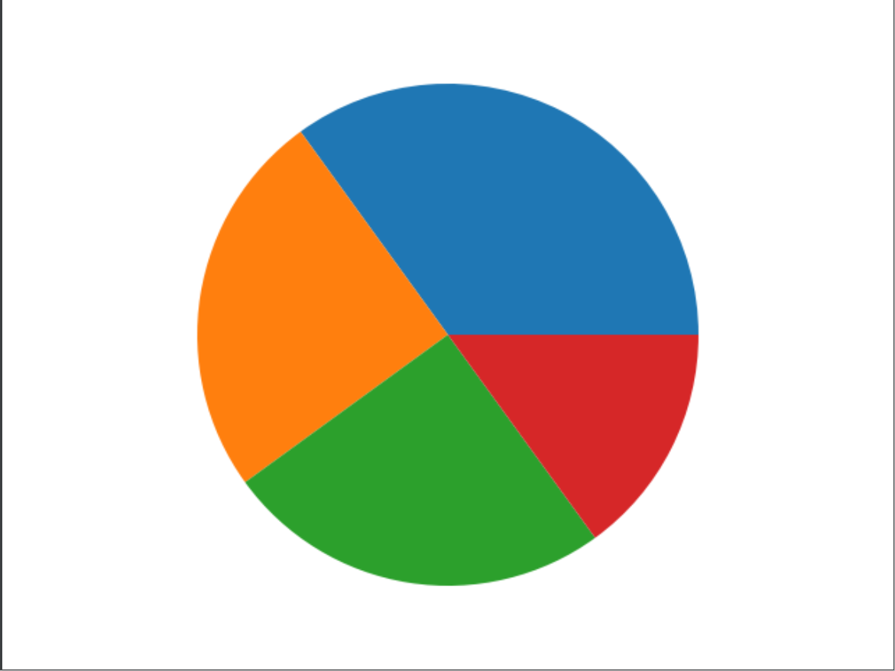

```python
import numpy as np
import matplotlib.pyplot as plt

y = [35,25,25,15]

plt.pie(y,labels = ['A','B','C','D'],
        colors = ["#d5695d", "#5d8ca8", "#65a479", "#a564c9"],
        explode = (0.1,0,0,0),
        autopct = '%.2f%%')
plt.title("This is a pie")
plt.show()
```


## 7.绘制多图

在pyplot中提供**subplot()**和**subplots()**两种方法来绘制多个子图

其中**subplot()**方法在绘图时需要指定位置

**subplots()**方法可以一次生成多个

### subplot()

```python
subplot(nrows, ncols, index, **kwargs)
subplot(pos, **kwargs)
subplot(**kwargs)
subplot(ax)
```

以上函数将整个绘图区域分成 nrows 行和 ncols 列，然后从左到右，从上到下的顺序对每个子区域进行编号 **1...N** ，左上的子区域的编号为 1、右下的区域编号为 N，编号可以通过参数 **index** 来设置。

设置 numRows ＝ 1，numCols ＝ 2，就是将图表绘制成 1x2 的图片区域, 对应的坐标为：

```
(1, 1), (1, 2)
```

**plotNum ＝ 1**, 表示的坐标为(1, 1), 即第一行第一列的子图。

**plotNum ＝ 2**, 表示的坐标为(1, 2), 即第一行第二列的子图。

```python
import numpy as np
import matplotlib.pyplot as plt

#plot 1:
a = plt.subplot(1,2,1)
xpoints = np.array([1,2,3,4,5,6,7,8,9,10,11,12,13,14])
ypoints = np.array([1,4,3,4,7,8,2,1,4,5,8,9,2,10])
plt.xlabel("x-label",loc = 'center')
plt.ylabel("y-label",loc = 'top')
plt.title("Practice of data visualization 1",loc = 'right')
plt.grid(axis = 'y',color = 'r',linestyle = ':',linewidth = '2')


plt.plot(xpoints,ypoints,ls=':',lw=3,c='g',marker='*',mfc='r',mec='g',ms = 10)

#plot 2:
b = plt.subplot(1,2,2)
ypoint1 = np.array([1,2,3,5,7,3,1,9,0,3,4,5])
ypoint2 = np.array([1,10,3,6,7,3,2,5,7,8,2,1])
plt.xlabel("x",loc = 'center')
plt.ylabel("y",loc = 'center')
plt.title("Practice of data visualization 2",loc = 'center')


plt.plot(ypoint1,ls = '-.',lw = 2,c = 'r',marker = 'o',ms = 4)
plt.plot(ypoint2)

plt.suptitle("subplot Test")
plt.show()
```

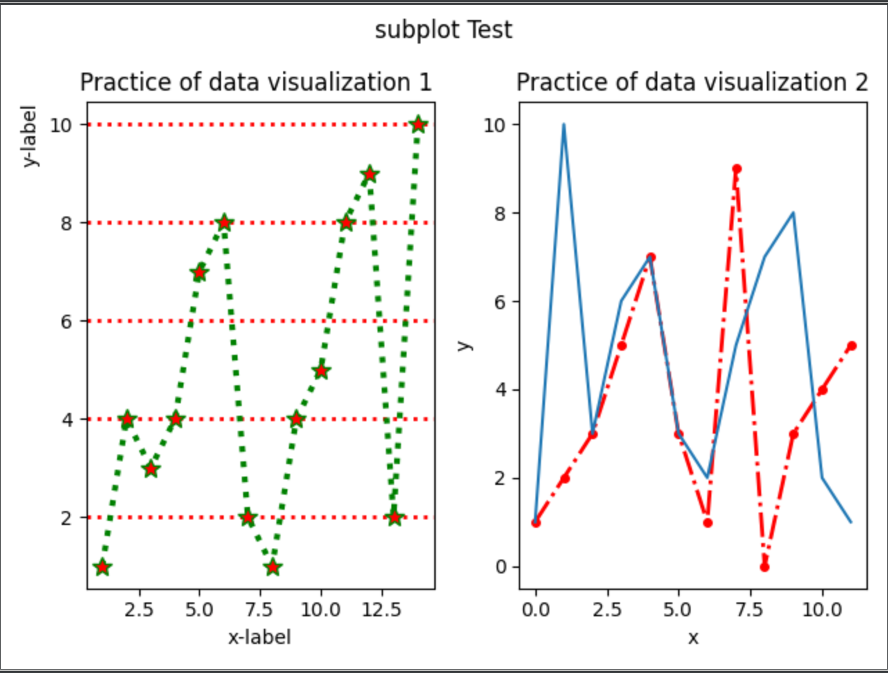

### subplots()

subplots() 方法语法格式如下：

```
matplotlib.pyplot.subplots(nrows=1, ncols=1, *, sharex=False, sharey=False, squeeze=True, subplot_kw=None, gridspec_kw=None, **fig_kw)
```

**参数说明：**


- **nrows**：默认为 1，设置图表的行数。
- **ncols**：默认为 1，设置图表的列数。
- 
- **sharex、sharey**：设置 x、y 轴是否共享属性，默认为 false，可设置为 'none'、'all'、'row' 或 'col'。 False 或 none 每个子图的 x 轴或 y 轴都是独立的，True 或 'all'：所有子图共享 x 轴或 y 轴，'row' 设置每个子图行共享一个 x 轴或 y 轴，'col'：设置每个子图列共享一个 x 轴或 y 轴。
- **squeeze**：布尔值，默认为 True，表示额外的维度从返回的 Axes(轴)对象中挤出，对于 N*1 或 1*N 个子图，返回一个 1 维数组，对于 N*M，N>1 和 M>1 返回一个 2 维数组。如果设置为 False，则不进行挤压操作，返回一个元素为 Axes 实例的2维数组，即使它最终是1x1。
- **subplot_kw**：可选，字典类型。把字典的关键字传递给 add_subplot() 来创建每个子图。
- **gridspec_kw**：可选，字典类型。把字典的关键字传递给 GridSpec 构造函数创建子图放在网格里(grid)。
- ***\*fig_kw**：把详细的关键字参数传给 figure() 函数。

```python
import matplotlib.pyplot as plt
import numpy as np

# 创建一些测试数据 -- 图1
x = np.linspace(0, 2*np.pi, 400)
y = np.sin(x**2)

# 创建一个画像和子图 -- 图2
fig, ax = plt.subplots()
ax.plot(x, y)
ax.set_title('Simple plot')

# 创建两个子图 -- 图3
f, (ax1, ax2) = plt.subplots(1, 2, sharey=True)
ax1.plot(x, y)
ax1.set_title('Sharing Y axis')
ax2.scatter(x, y)

# 创建四个子图 -- 图4
fig, axs = plt.subplots(2, 2, subplot_kw=dict(projection="polar"))
axs[0, 0].plot(x, y)
axs[1, 1].scatter(x, y)

# 共享 x 轴
plt.subplots(2, 2, sharex='col')

# 共享 y 轴
plt.subplots(2, 2, sharey='row')

# 共享 x 轴和 y 轴
plt.subplots(2, 2, sharex='all', sharey='all')

# 这个也是共享 x 轴和 y 轴
plt.subplots(2, 2, sharex=True, sharey=True)

# 创建10 张图，已经存在的则删除
fig, ax = plt.subplots(num=10, clear=True)

plt.show()
```

